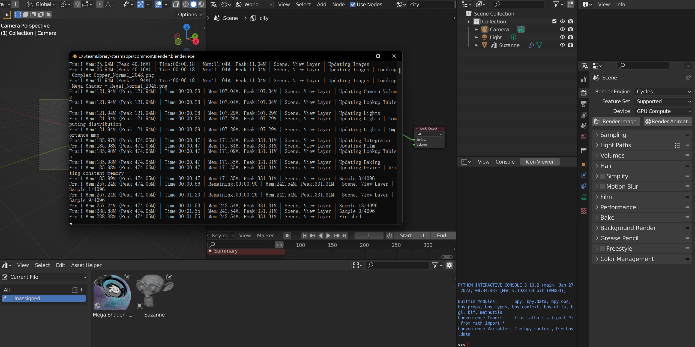
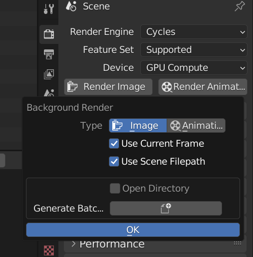

> This is a must-have addon plugin for background rendering without freezing the current file [Free addon]

## Download

[[Gumroad](https://atticuslv.gumroad.com/l/tszuk)](https://atticuslv.gumroad.com/l/tszuk)

[[Github-master](https://github.com/atticus-lv/background_render/archive/refs/heads/master.zip)](https://github.com/atticus-lv/background_render/archive/refs/heads/master.zip)

### log
v0.2
+ fix: path with space will not work

## Intro

**Install**

Edit > Preferences > Add-on > Intall

**Usage**

1. Save the current file
2. In the properties panel, click 'Render Image' or 'Render Animation'  *Ctrl to set the options*
3. *Continue with the current creation and wait for the background rendering to complete*

**Options**

> *Ctrl to Render image/Render animation to set the options*

1. 
2. Use Current Frame/output path:  Use the current render Settings. If unchecked, frame range and path options popup
3. Open directory：Open the directory after rendering to preview your progress
4. Generate batch files：A.bat file is generated based on Settings and the current file path, which can be run without opening Blender